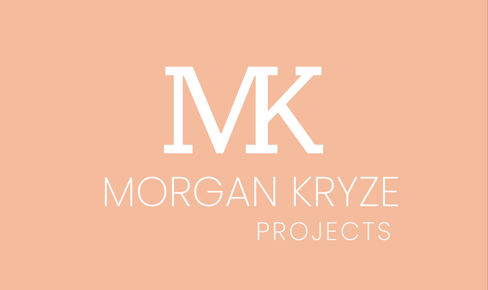

# Repository-Template

> Add a short description of the project here.



## Getting Started

### Introduction

Provide an introduction to the project. This section should be short and concise. It may include a link to an important [reference](https://example.com).

### Prerequisites

- Define tools and libraries that are required to run the project with the version number.
- If available, provide a link to the installation guide.

### Install

Details here explicit instructions to install the project.

Here are the info blocks available for github markdown:

> [!NOTE]
> Do not hesitate to add a note if necessary.

> [!TIP]
> Do not hesitate to add a tip if necessary.

> [!WARNING]
> Do not hesitate to add a warning if necessary.

> [!IMPORTANT]
> Do not hesitate to add an important note if necessary.

> [!CAUTION]
> Do not hesitate to add a caution if necessary.

### Build & Run

Detail here the instructions to build and run the project.

### Usage

Detail here the instructions to use the project.

### Troubleshooting

Detail here the troubleshooting of the project.

### Project structure

Here are the most important files and directories of the project (you may ignore the other files and directories):

```plaintext
Repository-Template
├── src
│   ├── assets
│   │   └── img
│   │       └── screenshot.png
│   └── project-code.sh
├── .gitignore
├── SECURITY
├── CODE_OF_CONDUCT
├── CONTRIBUTING
├── LICENCE
└── README.md
```

#### Small descriptives

##### `src/`

This directory contains the source code of the project.

##### `src/assets/`

This directory contains the assets of the project.

##### Files

If necessary, provide a description of the most important files of the project.

## Supported platforms

- Precise here the platforms that are supported by the project.
- If available, provide a link to the installation guide.
- If in testing, do not hesitate to mention it.

## Supported languages

- Precise here the languages that are supported by the project.
- If necessary, precise if some languages needs to be checked.

## Future improvements

- Precise here the future improvements that are planned for the project.
- ~~Imporvement done can be styled like this.~~

## Contributing

If you want to contribute to the project, you can follow the steps described in the [CONTRIBUTING](CONTRIBUTING) file.

## License

This project is licensed under the MIT License - see the [LICENSE.md](LICENSE) file for details.
