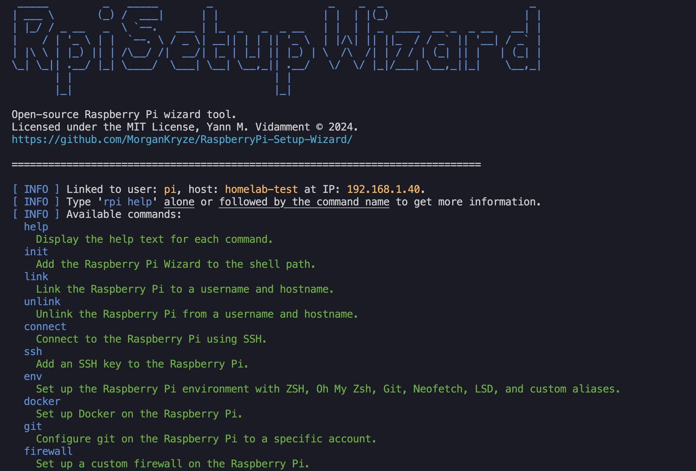

# Raspberry Pi Setup Wizard

> All-in-one script to setup a Raspberry Pi as a server/homelab.



## Getting Started

### Introduction

Raspberry Pi Setup Wizard is an all-in-one script to setup a Raspberry Pi as a server/homelab. It is designed to be run on a fresh install of Raspberry Pi OS Lite/Desktop. Pay attention to the prerequisites and the install section before running the script.

### Prerequisites

- Hardware:
  - Raspberry Pi 3/4/Zero
  - MicroSD card (8GB or more)
  - Power supply
  - Ethernet cable or Wi-Fi connectivity
- Software:
  - Raspberry Pi OS Lite/Desktop flashed from [Raspberry Pi Imager](https://www.raspberrypi.org/software/) (username & hostname has to be defined)
  - SSH enabled
  - Internet connection
- Host machine:
  - macOS (ideal) with [Homebrew](https://brew.sh/) and [Git](https://git-scm.com/) installed
  - Linux (not tested, **may** require changes)
  - Windows (not tested, **will** require changes)

### Install

> [!NOTE]
> The installation process is intended for macOS users. Linux and Windows users are welcome to contribute to the project by providing the necessary changes.

First we need to install the required dependency:

```bash
brew install jq
```

Then, we will clone the project to a local permanent directory:

```bash
cd ~ # Optional
```

```bash
git clone https://github.com/MorganKryze/RaspberryPi-Setup-Wizard.git
cd RaspberryPi-Setup-Wizard
```

> [!CAUTION]
> The location should be permanent as the script will be run from this directory. Its value will be stored in the ~/.zshrc file (you may change it to ~/.bashrc if you are using bash).

Finally, we will run the script and follow the instructions:

```bash
source src/rpi-wizard.sh ; rpi init
```

Once finished, restart your terminal and run the following command to confirm the installation:

```bash
rpi
```

If it displays the welcome message, the installation was successful.

### Usage

#### Format

The commands are decomposed as:

```bash
rpi <command> <options>
```

#### Help

The help command will display the available commands and their usage:

```bash
rpi help
```

Or

```bash
rpi help <command>
```

#### Commands

- `help`: Display the help message.
- `init`: Initialize the script.
- `update`: Update the script.
- `link`: Store the Raspberry Pi username and hostname.
- `unlink`: Remove the stored Raspberry Pi username and hostname.
- `connect`: Connect to the Raspberry Pi.
- `ssh`: Add the SSH key to the Raspberry Pi.
- `env`: Set up the Raspberry Pi environment.
- `docker`: Install Docker on the Raspberry Pi.
- `git`: Set up Git on the Raspberry Pi to push/pull repositories.
- `firewall`: Set up the firewall on the Raspberry Pi.

### Project structure

```plaintext
RaspberryPi-Setup-Wizard
├── .github
├── src
│   └── rpi-wizard.sh
├── conf
│   ├── 20auto-upgrades
│   └── 50unattended-upgrades
├── assets
│   └── img
│       └── screenshot.jpg
├── .gitignore
├── LICENCE
└── README.md
```

#### Small descriptive

##### `src/`

This directory contains the executable script of the project.

##### `config/`

This directory contains the configuration files for the unattended-upgrades config.

## Supported platforms

- macOS (ideal)
- Linux (not tested, **may** require changes)
- Windows (not tested, **will** require changes)

## Future improvements

- Linux & Windows compatibility.
- More customization options & features (*feel free to suggest some*).

## Contributing

If you want to contribute to the project, you can follow the steps described in the [CONTRIBUTING](CONTRIBUTING) file.

## License

This project is licensed under the MIT License - see the [LICENSE.md](LICENSE) file for details.
